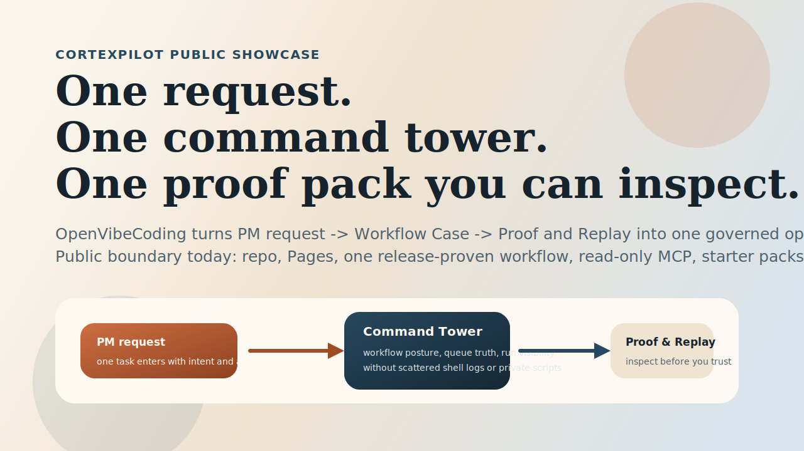
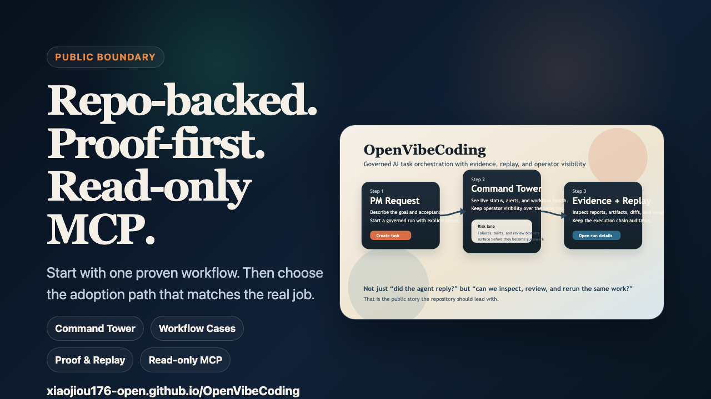
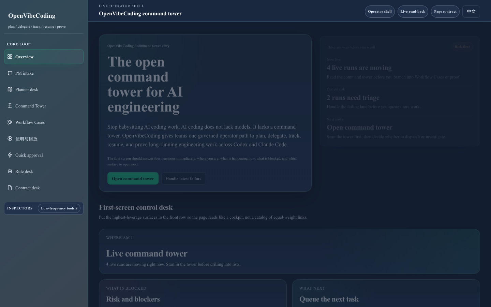
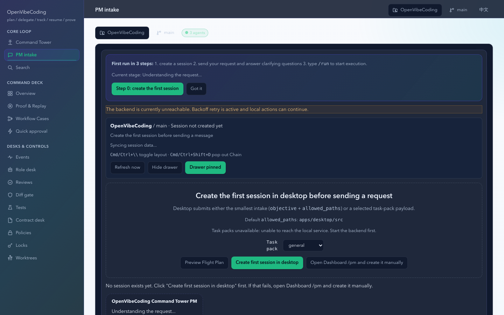

# OpenVibeCoding

The open command tower for AI engineering.

Stop babysitting AI coding work.

AI coding does not lack models. It lacks a command tower.

OpenVibeCoding is the command tower for AI engineering. It helps teams
plan / delegate / track / resume / prove long-running engineering work across
Codex and Claude Code instead of juggling scattered chats, local scripts, and
after-the-fact logs.

OpenVibeCoding is a contract-first multi-agent orchestration repository.

The public story is intentionally narrower than the full monorepo:

- **See one proven workflow first**
- **Choose the right adoption path second**
- **Open MCP / API / builder / skills surfaces only after the real job is clear**

Current public boundary: OpenVibeCoding is a repo-backed command tower, not a
hosted product, and the shipped MCP surface remains **read-only**.

Current lane order is deliberate:

- **Primary lane** = the read-only MCP package plus the Official MCP Registry entry
- **Secondary lane** = the adoption-router public skill packet
- **Companion/example lane** = local starter kits and coding-agent bundle examples, which are not the canonical public root

[Quickstart](#quickstart) · [Watch the 18s Teaser](docs/assets/storefront/openvibecoding-command-tower-teaser.mp4) · [First Proven Workflow](https://xiaojiou176-open.github.io/OpenVibeCoding/use-cases/) · [Compatibility Matrix](https://xiaojiou176-open.github.io/OpenVibeCoding/compatibility/) · [Distribution Status](https://xiaojiou176-open.github.io/OpenVibeCoding/distribution/) · [Public Docs](https://xiaojiou176-open.github.io/OpenVibeCoding/) · [AI + MCP + API Surfaces](https://xiaojiou176-open.github.io/OpenVibeCoding/ai-surfaces/) · [Builder Quickstart](https://xiaojiou176-open.github.io/OpenVibeCoding/builders/) · [Releases](https://github.com/xiaojiou176-open/OpenVibeCoding/releases)



If you want the fastest product read instead of the full distribution matrix,
open the 18-second teaser first.

[](docs/assets/storefront/openvibecoding-command-tower-teaser.mp4)

## Why OpenVibeCoding Exists

Most agent demos stop at "the model replied." OpenVibeCoding is built for the
next question: **can we inspect what happened, review what changed, classify
the workflow case, and rerun it without guessing?**

The deeper product claim is straightforward:

- **Plan** the next move instead of improvising one more prompt.
- **Delegate** scoped work without losing the case record.
- **Track** live progress and queue posture from one command tower.
- **Resume** long-running work when humans step away or sessions degrade.
- **Prove** what happened with evidence, compare, replay, and approvals.

The engineering philosophy underneath that loop is equally explicit:

- **Prompt Engineering**: write the right worker brief, scope, constraints, and deliverables.
- **Context Engineering**: keep the right material in the right head, and treat explicit handoff as a fallback rather than the default loop.
- **Harness Engineering**: move work through contracts, runtime bindings, approvals, and proof surfaces so the system can keep operating safely.

OpenVibeCoding currently combines:

- **Command Tower**: one operator surface for governed AI work, live run visibility, queue posture, and L0-style oversight
- **Workflow Cases**: one stable operating record that ties request, verdict, proof, and linked runs together
- **Proof & Replay**: one place to inspect evidence bundles, compare reruns, and replay failures before promotion
- **Control surfaces**: a web dashboard plus a macOS desktop shell for the same command tower
- **Read-only inspection surfaces**: repo-local MCP, API, and contract read models that expose truth without turning mirrors into execution authority
- **Governed boundaries**: fail-closed gates for CI, host safety, repo hygiene, and public-proof honesty

If you need the deeper public bundle/runtime/read-model map, open the focused
public entrypoints instead of treating the root README like the whole
control-plane manual:

- [AI + MCP + API Surfaces](https://xiaojiou176-open.github.io/OpenVibeCoding/ai-surfaces/)
- [Builder Quickstart](https://xiaojiou176-open.github.io/OpenVibeCoding/builders/)
- [API quickstart](https://xiaojiou176-open.github.io/OpenVibeCoding/api/)
- [Distribution Status](https://xiaojiou176-open.github.io/OpenVibeCoding/distribution/)

## Official Distribution Story

The shortest truthful answer today is:

> OpenVibeCoding currently ships through the public OpenVibeCoding repo, a public
> Pages front door, a repo-local read-only MCP surface, one legacy-branded live
> PyPI package plus one legacy-branded live Official MCP Registry entry for that
> same read-only runtime, and a live ClawHub skill. The adoption-router skill is
> the secondary public lane. Local coding-agent starters and bundle examples
> remain companion/example materials, not the canonical public root. MCP.so
> still has an open external submission receipt, while the previous
> OpenHands/extensions submission is closed without a live listing. Hosted
> service, write-capable MCP, Docker distribution, and standalone npm releases
> remain deferred.

Use these buckets:

- **Shipped now**: repo, Pages, proof-first docs, read-only MCP, legacy-branded live PyPI package + Official MCP Registry entry, ClawHub skill
- **Starter-only / example lane**: Codex / Claude Code / OpenClaw local starter kits and local coding-agent bundle examples
- **Submitted externally**: `chatmcp/mcpso#1559` is still open; `OpenHands/extensions#151` remains a public receipt but is closed without a live listing
- **Publish-ready but deferred**:
  `@openvibecoding/frontend-api-client`,
  `@openvibecoding/frontend-api-contract`
- **Workspace-only**: `@openvibecoding/frontend-shared` stays repo-owned and is
  not marketed as a standalone package
- **Deferred**: hosted operator, write-capable MCP, Docker image, and standalone npm releases

If you need the exact matrix instead of a one-line summary, open the public
[Distribution Status](https://xiaojiou176-open.github.io/OpenVibeCoding/distribution/)
page.






## Open The Right Door

| If you're here to... | Open this first |
| --- | --- |
| evaluate the product story | [First Proven Workflow](https://xiaojiou176-open.github.io/OpenVibeCoding/use-cases/) |
| choose the right Codex / Claude Code / OpenClaw / MCP / skills / builder path | [Compatibility Matrix](https://xiaojiou176-open.github.io/OpenVibeCoding/compatibility/) |
| see exactly what ships now vs. later | [Distribution Status](https://xiaojiou176-open.github.io/OpenVibeCoding/distribution/) |
| build on the protocol or package surfaces | [AI + MCP + API Surfaces](https://xiaojiou176-open.github.io/OpenVibeCoding/ai-surfaces/) and [Builder Quickstart](https://xiaojiou176-open.github.io/OpenVibeCoding/builders/) |

The default public loop is simple: **start one workflow case, watch it move
through Command Tower, then inspect Proof & Replay before you trust the
outcome**.

## First Practical Win

If you only want the fastest truthful first result, use one of these three
paths:

| I want to... | Run this first | What I get |
| --- | --- | --- |
| see the full operator surface quickly | `npm run bootstrap:host && npm run dev` | the localhost orchestrator API plus dashboard in one local product loop |
| iterate on the dashboard only | `npm run bootstrap:host && npm run dashboard:dev` | the dashboard shell on port 3100; use this when the API is already running |
| validate the smallest governed path | `OPENVIBECODING_HOST_COMPAT=1 bash scripts/test_quick.sh --no-related` | the quickest repo-side proof path without pretending the full system already ran |
| inspect what the system records | open the run list and `.runtime-cache/` after the quick path | a concrete evidence bundle and replay surface, not just a shell success line |

A clean first pass should let you:

- create one task from the PM surface
- watch that task appear in **Command Tower**
- confirm the linked **Workflow Case**
- inspect **Proof & Replay** before trusting the result

For the public product story, the current official first proven workflow is
[`news_digest`](https://xiaojiou176-open.github.io/OpenVibeCoding/use-cases/).
`topic_brief` now has a tracked search-backed public proof bundle, but it is
still not the official first public baseline and should not be described as
equally release-proven with `news_digest`.
`page_brief` now has a tracked browser-backed public proof bundle, but it is
still not the official first public baseline and should not be described as
equally release-proven with `news_digest`.
The public use-cases page is meant to act like the human-readable proof story,
not a router into raw manifests, ledgers, or maintainer-grade capture
contracts.

If this repository is close to your use case, star it to track the first public
release, new task templates, and storefront updates.

If you need contributor setup instead of product evaluation, jump to
[CONTRIBUTING.md](CONTRIBUTING.md) and the local quickstart below.

## Quickstart

### First Success Path

1. Bootstrap the host toolchain:

   ```bash
   npm run bootstrap:host
   ```

2. Run the smallest verified safety path:

   ```bash
   OPENVIBECODING_HOST_COMPAT=1 bash scripts/test_quick.sh --no-related
   ```

3. Open the full local product loop:

   ```bash
   npm run dev
   ```

   This path starts a localhost-only API lane together with the dashboard so the browser can exercise PM, Command Tower, Workflow Cases, and Runs without sending a public bearer token from the client.

What you should see:

- create a task from the PM surface
- watch status move in Command Tower
- confirm the Workflow Case state, then inspect runs, reports, and evidence from the run list

If you only need the dashboard shell while the API is already running in another
terminal, use:

```bash
npm run dashboard:dev
```

If you want the full reproducible containerized setup instead of the shortest
host path, use:

```bash
npm run bootstrap
```

If the first success path fails, go here next:

- [Public Docs](https://xiaojiou176-open.github.io/OpenVibeCoding/)
- [Support](SUPPORT.md)
- [Security reporting](SECURITY.md)

## The First Loop

The clearest way to understand OpenVibeCoding is:

1. **PM**: describe the task and acceptance target
2. **Workflow Case**: confirm the case identity, queue state, and operating verdict
3. **Command Tower**: confirm the run is moving and not stuck
4. **Proof & Replay**: inspect reports, diffs, artifacts, compare state, and replay state

That flow already exists in the dashboard app and is the public story this
repository should be judged on.

## Public Platform Boundary

- orchestrator and dashboard remain part of the public repository surface
- desktop public support is currently **macOS only**
- Linux/BSD desktop is unsupported in the current public support contract; any
  related evidence is manual or historical only and excluded from the default
  closeout and governance receipt path
- Windows desktop is not part of the current public support contract
- the repo-local MCP surface is currently **read-only only**; write-capable MCP
  remains gated and is not part of the current public/product contract
- the current Switchyard compatibility slice is **runtime-first and chat-only**
  on the orchestrator side: `apps/orchestrator/` can point at
  `Switchyard /v1/runtime/invoke` for intake/operator-style chat paths, but
  MCP tool execution still needs a tool-capable provider path and therefore
  fails closed instead of pretending Switchyard already has tool parity
- OpenVibeCoding is still **not** a hosted
  operator service; `openvibecoding.ai` should be treated as a marketing/holding
  domain until the public contract, support boundary, and live surface
  materially change

## Public CI Safety Model

Public collaboration follows a hosted-first contract:

- all default public CI routes run on **GitHub-hosted** runners
- fork PRs stay on a low-privilege path and must not touch secrets, live
  providers, or high-cost external checks
- maintainer-owned PRs still use GitHub-hosted policy/core lanes; they do not
  fall back to private runner pools
- sensitive verification lanes (`ui-truth`, `resilience-and-e2e`,
  `release-evidence`) are **manual `workflow_dispatch` lanes only**
- sensitive lanes require the protected environment
  `owner-approved-sensitive`, so owner review happens before secrets or live
  systems are touched

The machine CI contract lives in `configs/ci_governance_policy.json`, and the
live GitHub control-plane requirements live in
`configs/github_control_plane_policy.json`.

Repo-first pushes on a freshly created GitHub repository may set
`github.event.before` to the all-zero SHA. OpenVibeCoding's repo-owned doc-drift
and doc-sync hooks now skip `ci-diff` comparison for that bootstrap-only case
so Quick Feedback fails only on real drift, not on the lack of an initial
baseline commit. The `GitHub Control Plane` workflow also prefers the repo
secret `GH_ADMIN_TOKEN` when present, because the default workflow token cannot
prove admin-only repository APIs such as Actions permissions, branch
protection, or vulnerability-alert endpoints.

Security/fixture hygiene follows the same truth contract: public tests and
docs must use generic workspace roots plus runtime-built token-like samples
instead of maintainer-local absolute paths or raw secret-looking literals, and
`scripts/security_scan.sh` must stay compatible with BSD/macOS temp-file
semantics so local history scans do not fail before the real secret gate runs.
The same closeout path now has explicit repo-owned wrappers for GitHub Actions
static security (`bash scripts/check_workflow_static_security.sh`), repo
filesystem/dependency scanning (`bash scripts/check_trivy_repo_scan.sh`), and
current-tree plus fresh-clone secret scanning
(`bash scripts/check_secret_scan_closeout.sh --mode both`), while pull
requests also run a repo-owned dependency review gate against GitHub's
official dependency-graph compare API, driven by the same
`.github/dependency-review-config.yml` policy.
GitHub-hosted `trusted_pr`, `untrusted_pr`, and hosted-first `push_main`
routes keep the live alerts query in advisory mode for Quick Feedback and the
hosted policy slice, because the integration token cannot always read the
secret/code-scanning alert APIs there and a fresh hosted `push_main` route may
not have CodeQL/secret-scanning analysis materialized yet; the fail-closed
contract still holds on local hooks, local repo hygiene, pre-push, and other
routes that carry authoritative credentials.

Hosted-first `push_main` follows the same external-truth boundary as PR routes:
protected upstream/provider smoke stays a manual closeout concern, so the
governance manifest treats those receipts as route-exempt on `trusted_pr`,
`untrusted_pr`, and `push_main` instead of failing base CI on missing
provider/live credentials.

That same hosted-first rule now carries through the closeout builder: when the
manifest marks upstream/live smoke route-exempt on `push_main`, the generated
`upstream_report`, `upstream_same_run_report`, and `current_run_consistency`
payloads are advisory rather than hard blockers for base CI.

## Host Process Safety

Before live desktop, browser, cleanup, or closeout commands, run:

```bash
npm run scan:host-process-risks
```

Worker/test/orchestrator paths fail closed on host-process safety:

- no `killall`, `pkill`, process-group kills, or negative/zero PID signals
- no AppleScript `System Events` for desktop-wide probing or control
- only the recorded child handle started by the current script may be terminated
- if stale repo-owned runtime state already exists, the script must stop with
  manual cleanup instructions instead of broad process cleanup
- repo-owned `scripts/*.py` entrypoints must keep shared helper imports usable
  when executed directly as `python3 scripts/<name>.py`; they cannot assume the
  repo root has already been injected into `PYTHONPATH`

## Current Public Task Slices

The intentionally supported public task slices are:

- `news_digest`
- `topic_brief`
- `page_brief`

The current dashboard front door now surfaces all three public cases, while
`news_digest` remains the most release-proven proof-oriented first run.

| Public case | Best for | Example input | Proof state |
| --- | --- | --- | --- |
| `news_digest` | the fastest proof-oriented public first run | one topic + 3 public domains + `24h` | **official first public baseline** |
| `topic_brief` | a narrow topic brief with search-backed evidence | one topic + `7d` + max results | tracked search-backed public proof bundle |
| `page_brief` | one URL with browser-backed evidence | one URL + one focused summary request | tracked browser-backed public proof bundle |

For the first public release bundle, `news_digest` is the only official
proof-oriented first-run baseline. `topic_brief` now has its own tracked
search-backed public proof bundle, but it still should not be described as the
official first baseline or as equally release-proven with `news_digest`.
`page_brief` now has its own tracked browser-backed public proof bundle, but it
still should not be described as the official first baseline or as equally
release-proven with `news_digest`.

## Works With Today

Use these names as ecosystem anchors, not as co-brands or partnership claims.

- **Codex**: primary workflow audience; OpenVibeCoding is built for governed
  Codex-style coding runs that need cases, approvals, and replayable proof.
- **Claude Code**: primary workflow audience alongside Codex; the same
  Command Tower / Workflow Case / Proof & Replay spine applies.
- **MCP**: the current product truth is a **read-only MCP surface** for runs,
  workflows, queue posture, approvals, and proof-oriented reads.
- **OpenHands**: adjacent ecosystem mention only; use it in body-copy
  comparison or “broader agent stacks” language, not in the hero.
- **OpenCode**: comparison-only and transition-sensitive; do not use it as a
  primary front-door anchor.
- **OpenClaw**: secondary adoption lane with real plugin and skills surfaces of
  its own; keep it out of the current front door, but use the repo-owned agent
  starter kits and compatible local bundle examples when a team needs the
  proof/replay/read-only MCP layer there.

## Official Ecosystem Anchors

When a team asks "what is real on their side?", start from the native surfaces
below before you explain where OpenVibeCoding fits:

- **Codex**:
  - repo: [openai/codex](https://github.com/openai/codex)
  - docs: [developers.openai.com/codex](https://developers.openai.com/codex)
  - IDE path: [developers.openai.com/codex/ide](https://developers.openai.com/codex/ide)
  - plugins: [developers.openai.com/codex/plugins](https://developers.openai.com/codex/plugins)
- **Claude Code**:
  - overview: [code.claude.com/docs/en/overview](https://code.claude.com/docs/en/overview)
  - MCP docs: [code.claude.com/docs/en/mcp](https://code.claude.com/docs/en/mcp)
  - plugins: [code.claude.com/docs/en/plugins](https://code.claude.com/docs/en/plugins)
  - hooks: [docs.anthropic.com/en/docs/claude-code/hooks](https://docs.anthropic.com/en/docs/claude-code/hooks)
  - subagents: [docs.anthropic.com/en/docs/claude-code/sub-agents](https://docs.anthropic.com/en/docs/claude-code/sub-agents)
- **OpenClaw**:
  - repo: [openclaw/openclaw](https://github.com/openclaw/openclaw)
  - plugins docs: [docs.openclaw.ai/tools/plugins](https://docs.openclaw.ai/tools/plugins)
  - skills docs: [docs.openclaw.ai/tools/skills](https://docs.openclaw.ai/tools/skills)
  - registry/catalog: [openclaw/clawhub](https://github.com/openclaw/clawhub)

These anchors matter because OpenVibeCoding should fit around the real ecosystem
surfaces that already exist:

- **Codex**: Codex now has real plugin surfaces of its own, including local
  marketplace installs and a curated official directory. OpenVibeCoding should sit
  around Codex workflows with command tower, proof, replay, read-only MCP, and
  repo-owned skills or local bundle examples until a real published listing
  exists.
- **Claude Code**: Claude Code's current native surfaces include plugins, MCP,
  hooks, subagents, and project configuration. OpenVibeCoding should wrap those
  governed workflows with command tower, proof, replay, read-only MCP, and
  repo-owned starter kits rather than pretending a published OpenVibeCoding
  marketplace listing already exists.
- **OpenClaw**: adjacent integration layer with real skills and plugin/catalog
  surfaces on its side, while OpenVibeCoding stays on the review/proof/read-only
  integration side unless a mapped native path is explicitly shipped and
  tested.

## First Run To Proof To Share

The strongest public loop is now:

1. Start one of the three public first-run cases.
2. Confirm the result in **Command Tower**, **Workflow Cases**, and
   **Proof & Replay**.
3. Reuse the Workflow Case as a **share-ready recap asset** instead of keeping
   it trapped inside a single operator page.

That turns OpenVibeCoding from “a repo you can run” into “a repo you can show,
review, and hand off.”

## Builder Entry Points

These are the current public-facing entry points for teams that want to build
around OpenVibeCoding without pretending a full SDK platform already exists:

- [Builder Quickstart](https://xiaojiou176-open.github.io/OpenVibeCoding/builders/): the public starting point for `@openvibecoding/frontend-api-client`, workspace reuse, and the repo-owned `createControlPlaneStarter(...)` bootstrap flow.
- [API quickstart](https://xiaojiou176-open.github.io/OpenVibeCoding/api/): the public route for `@openvibecoding/frontend-api-contract`, route/query names, and the current machine-facing HTTP boundary.
- [AI + MCP + API Surfaces](https://xiaojiou176-open.github.io/OpenVibeCoding/ai-surfaces/): the public map for package roles, MCP boundaries, and how the builder edge fits the broader command-tower story.
- `@openvibecoding/frontend-shared` remains a workspace-only presentation substrate and is intentionally described through the public builder surface instead of a front-door internal package README link.

## Copy-paste coding-agent examples

If your team needs starter assets instead of only wording, open:

- [examples/coding-agents/README.md](examples/coding-agents/README.md): one map for Codex, Claude Code, OpenClaw, and the shared read-only MCP recipe
- [examples/coding-agents/codex/marketplace.example.json](examples/coding-agents/codex/marketplace.example.json): local Codex marketplace entry
- [examples/coding-agents/plugin-bundles/openvibecoding-coding-agent-bundle/.codex-plugin/plugin.json](examples/coding-agents/plugin-bundles/openvibecoding-coding-agent-bundle/.codex-plugin/plugin.json): compatible local skill-bundle manifest
- [examples/coding-agents/claude-code/README.md](examples/coding-agents/claude-code/README.md): `.claude/` command + agent starter
- [examples/coding-agents/openclaw/README.md](examples/coding-agents/openclaw/README.md): OpenClaw-compatible local bundle recipe
- [examples/coding-agents/mcp/readonly.mcp.json.example](examples/coding-agents/mcp/readonly.mcp.json.example): shared read-only MCP config example

## Shortest Cross-Ecosystem Adoption Order

If you are integrating OpenVibeCoding into a coding-agent workflow, the shortest
truthful order is:

1. Confirm the native ecosystem surface first:
   - Codex CLI / IDE
   - Claude Code overview / MCP
   - OpenClaw repo / skills / ClawHub
2. Use the public [compatibility matrix](https://xiaojiou176-open.github.io/OpenVibeCoding/compatibility/)
   to choose the right OpenVibeCoding entrypoint.
3. Pick the first OpenVibeCoding lane based on the job:
   - [read-only MCP](https://xiaojiou176-open.github.io/OpenVibeCoding/mcp/)
     for protocol inspection
   - [skills quickstart](https://xiaojiou176-open.github.io/OpenVibeCoding/skills/)
     for repeatable playbooks
   - [builder quickstart](https://xiaojiou176-open.github.io/OpenVibeCoding/builders/)
     for package-level reuse
   - [use cases](https://xiaojiou176-open.github.io/OpenVibeCoding/use-cases/)
     for proof-first rollout
4. When package reuse is the real next step, run the repo-owned starter example
   instead of reconstructing the flow from prose:

   ```bash
   node packages/frontend-api-client/examples/control_plane_starter.local.mjs \
     --base-url http://127.0.0.1:10000 \
     --role WORKER \
     --mutation-role TECH_LEAD \
     --preview-provider cliproxyapi \
     --preview-model gpt-5.4
   ```

## Best Fit

OpenVibeCoding is a strong fit if you are building or evaluating:

- agent workflows that need **reviewable evidence**
- orchestration systems that need **replay / re-exec**
- operator-facing control planes for **runs, sessions, and reports**
- engineering teams that want **explicit contracts and hard gates**

## Not A Fit

OpenVibeCoding is not the right choice if you want:

- a polished hosted SaaS product
- write-capable agent control-plane mutations through MCP today
- a generic browser automation grab-bag
- a minimal single-file agent script with no governance overhead
- a broad-market no-ops-required end-user application

## Current Boundary Decisions

The current stage freeze keeps two high-risk directions explicitly constrained:

- **Write-capable MCP** remains **Later**.
- The public repo ships a **read-only MCP** surface only.
- Internal mutation APIs and approval flows exist, but they are not yet
  exposed as an agent-facing write surface.
- Repo-owned role configuration defaults now exist for future compiled
  contracts, but they are still operator-owned web/desktop controls rather than
  an agent-facing write capability.
- If this is ever reopened, the smallest safe move is one owner-only,
  manual-only, default-off queue mutation pilot with explicit audit evidence.
- Repo-side groundwork for that later-gated pilot can include queue preview,
  queue cancel, and a queue-only MCP pilot server. That pilot now also keeps
  `enqueue_from_run` behind an explicit
  `OPENVIBECODING_MCP_QUEUE_PILOT_ENABLE_APPLY=1` trusted-operator gate, so the
  preview surface can exist without silently turning mutation on by default.
  These repo-owned controls do not by themselves upgrade the public product
  contract into write-capable MCP.
- The narrow queue-only pilot contract remains repo-internal and intentionally
  sits outside the public front door until an owner-approved launch changes the
  public write boundary.

- **Hosted operator surface** remains **No-Go**.
- `openvibecoding.ai` is still a weak marketing/holding domain, not a production
  front door.
- The current public contract still describes OpenVibeCoding as source code plus
  operator/demo surfaces, not as a hosted service.
- Reopen hosted only if the public boundary, support contract, privacy/security
  wording, and live front door materially change together.
- A repo-side Render blueprint may exist for future guarded pilots, but that is
  not evidence of a live hosted operator surface by itself.

## Repository Surfaces

| Surface | What it does | Where to start |
| --- | --- | --- |
| `apps/orchestrator/` | execution, gates, evidence, replay, runtime state | [module README](apps/orchestrator/README.md) |
| `apps/dashboard/` | web operator surface for runs, sessions, and command visibility | [module README](apps/dashboard/README.md) |
| `apps/desktop/` | Tauri desktop shell for the same control plane | [module README](apps/desktop/README.md) |

## Public Collaboration Files

- [MIT License](LICENSE)
- [Contributing guide](CONTRIBUTING.md)
- [Security policy](SECURITY.md)
- [Support guide](SUPPORT.md)
- [Code of conduct](CODE_OF_CONDUCT.md)
- [Privacy note](PRIVACY.md)
- [Third-party notices](THIRD_PARTY_NOTICES.md)

Public bugs, documentation fixes, and usage questions go through
[SUPPORT.md](SUPPORT.md). Vulnerabilities go through
[SECURITY.md](SECURITY.md), which documents the GitHub advisory form as the
current private reporting path on the live public repository. An additional
verified fallback private channel is not yet published and should not be
assumed.

Default local verification path:

```bash
npm run ci
npm run test:quick
npm run test
npm run mutation:gate
npm run bench:e2e:speed:gate
```

`npm run ci` is now the hosted-aligned local fast gate. Use
`npm run ci:strict`, `npm run docs:check`, `bash scripts/check_repo_hygiene.sh`,
`npm run scan:workflow-security`, `npm run scan:trivy`, and
`npm run security:scan:closeout` only when you intentionally want the stricter
closeout/manual layers.
`npm run mutation:gate` is the root mutation entrypoint for the existing
Orchestrator mutation profiles, `npm run bench:e2e:speed:gate` is the
fail-closed benchmark gate that evaluates a real benchmark summary once a run
has produced one, and `npm run coverage:repo` now points to the active
coverage runner that prepares subproject dependencies before generating fresh
repo-level coverage receipts. Use `npm run coverage:repo:aggregate` only when
you intentionally want to re-aggregate already-existing coverage artifacts.

Current CI contract has five layers only:

| Layer | What it owns | Default posture |
| --- | --- | --- |
| `pre-commit` | cheap local commit-time quality gates | automatic, local, fast |
| `pre-push` | local fast verification before remote CI | automatic, local, still bounded |
| `hosted` | GitHub-hosted base CI and required checks | automatic, remote, hosted-first |
| `nightly` | scheduled heavier audits and analytics | automatic, scheduled, non-default |
| `manual` | owner-invoked closeout or high-cost validation | explicit, protected, high-friction |

There is no separate sixth CI layer anymore. Old extra-layer behavior now
belongs either to `nightly` scheduled governance or to explicit `manual`
verification.

Internal UI policy helpers still use `pr` as the hosted PR subprofile label.
That label is not a sixth top-level CI layer alongside the five layers above.

`npm run test:quick` now expects the dashboard clean-room install gate to
prove `jsdom` itself can load, instead of pinning success to the presence of a
specific transitive dependency layout such as `data-urls`.

Recent operator-surface upgrades now include:

- persisted `workflow case` snapshots under `.runtime-cache/openvibecoding/workflow-cases/`
- derived `proof_pack.json` reports for successful public task slices
- a dedicated run-compare surface alongside the existing Run Detail replay area
- a repo-local `mcp-readonly-server` entry for read-only runs/workflows/queue/approval/diff-gate/report access
- an AI operator copilot brief on dashboard Run Detail and Run Compare, grounded in compare/proof/incident/workflow truth
- a share-ready Workflow Case asset path in the dashboard for read-only recap, export, and handoff
- desktop-first Flight Plan preview before creating the first PM session
- queue scheduling inputs (`priority`, `scheduled_at`, `deadline_at`) with
  timezone-safe API validation

Useful additional entrypoints:

```bash
npm run dev
npm run space:audit
npm run space:gate:wave1
npm run space:gate:wave2
npm run space:gate:wave3
npm run dashboard:dev
npm run desktop:up
npm run truth:triage
```

Use `npm run dev` when you want the orchestrator API and dashboard together.
Keep `npm run dashboard:dev` for dashboard-only iteration after the API is
already running.

## Generated Governance Context

<!-- GENERATED:ci-topology-summary:start -->
- trust flow: `ci-trust-boundary -> quick-feedback -> hosted policy/core slices -> pr-release-critical-gates -> pr-ci-gate`
- hosted policy/core slices: `policy-and-security, core-tests`
- untrusted PR path: `quick-feedback -> untrusted-pr-basic-gates -> pr-ci-gate`
- protected sensitive lanes: `workflow_dispatch -> owner-approved-sensitive -> ui-truth / resilience-and-e2e / release-evidence`
- canonical machine SSOT: `configs/ci_governance_policy.json`
<!-- GENERATED:ci-topology-summary:end -->

<!-- GENERATED:current-run-evidence-summary:start -->
- authoritative release-truth builders must consume `.runtime-cache/openvibecoding/reports/ci/current_run/source_manifest.json`.
- the live current-run authority verdict belongs to `python3 scripts/check_ci_current_run_sources.py` and `.runtime-cache/openvibecoding/reports/ci/current_run/consistency.json`.
- current-run builders: `artifact_index/current_run_index`, `cost_profile`, `runner_health`, `slo`, `portal`, `provenance`.
- docs and wrappers must not hand-maintain live current-run status; they must point readers back to the checker receipts.
- if the current-run source manifest is missing, authoritative current-run reports must fail closed or run only in explicit advisory mode.
<!-- GENERATED:current-run-evidence-summary:end -->

<!-- GENERATED:coverage-summary:start -->
- repo coverage snapshot unavailable
- run `npm run coverage:repo` to refresh this fragment.
<!-- GENERATED:coverage-summary:end -->

## Required Check Policy

`configs/github_control_plane_policy.json` is the machine source of truth for
the repo-side required check names. Keep human-facing wording aligned with that
file, and keep this README as the only handwritten summary:

- `Quick Feedback`
- `PR Release-Critical Gates`
- `PR CI Gate`

Dashboard dependency lock refreshes are repo-owned maintenance work. When a
transitive patch touches `apps/dashboard/pnpm-lock.yaml`, keep the change set
paired with the root `package.json` / `pnpm-lock.yaml` update.
The current security-only refresh also pins `lodash-es@4.18.1` through the
repo-owned override layer so `lighthouse@13.0.3` no longer resolves the
vulnerable `lodash-es@4.17.23` path on either the root or dashboard lock
surface, which keeps the Dependabot follow-up narrow instead of turning it
into a broader Lighthouse upgrade.
Current dashboard lock maintenance also pins `follow-redirects@1.16.0`
through both the root and dashboard override surfaces so the maintained
dashboard lockfile no longer carries the cross-domain redirect header-leak
advisory on its isolated install path.
Current lock maintenance also removes the optional dashboard `depcheck`
dependency and pins patched `picomatch` / `brace-expansion` paths so GitHub
security findings do not linger on an otherwise unused dependency chain.
Desktop production builds run on Vite 8 / Rolldown; keep
`apps/desktop/vite.config.ts` vendor chunking in the current function-based
`manualChunks` form so `vite build` and the `ui-audit` closeout lane stay
compatible.
Dashboard/operator wording is now English-first across the tracked Command
Tower regression surface, and orchestrator intake responses only emit
`task_template` / `template_payload` when those values are actually present so
API/schema coverage and the live contract stay aligned.
Mainline CI now keeps policy snapshots, stage logs, and the orchestrator
coverage JSON under `.runtime-cache/test_output/ci/`, and the Python
dependency audit now pins `pygments==2.20.0`, so
`configs/pip_audit_ignored_advisories.json` is empty again instead of carrying
an upstream-unfixed downgrade for that package.
Upstream governance evidence now reuses only fully fresh smoke receipts; if
strict lanes do not already have the required upstream receipt bundle, the
governance manifest refresh falls back to `scripts/verify_upstream_slices.py --mode smoke`
to regenerate the receipts instead of failing on missing files alone.
Dashboard dependency installs now also carry an ENOSPC recovery branch that
retries with a workspace-local pnpm store and the registered dashboard install
env knobs when copy-heavy CI or local maintenance installs run out of disk;
that recovery path now also fails closed behind a registered minimum-headroom
threshold so low-disk hosts do not keep churning partial retry stores, and
dashboard/desktop clean-room installs now retry bounded transient npm registry
socket timeouts before they fail closed.
Desktop dependency installs now mirror the same ENOSPC recovery strategy,
including the registered desktop install env knobs that scope hardlink imports
to the recovery attempt, gate workspace-local recovery on registered minimum
headroom, and move retry stores onto workspace-local temp roots.
Docker-backed GitHub-hosted maintenance lanes now retry daemon prechecks with
bounded backoff and registered retry knobs before failing closed on a transient
socket refusal.
Strict hosted-first live provider probes now resolve credentials from process
env first and may fall back to `~/.codex/config.toml`; repo-local dotenv files
and shell-export fallback remain disabled in mainline contexts so the CI
credential contract stays auditable.
Runtime retention and space-governance now stay coupled at the report layer:
`retention_report.json` carries `log_lane_summary` plus `space_bridge`, while
space-governance receipts expose serial-only heavy cleanup ordering, expected
reclaim bytes, and post-cleanup verification metadata. Repo-external apply
scope remains limited to `~/.cache/openvibecoding`; Docker Desktop, global
Cargo/Rustup, global uv, global npm, and global Playwright remain observation
only.
Repo-authored runtime/test/temp/report artifacts stay under `.runtime-cache/`,
while app-local `node_modules`, `.next`, `.venv`, `dist`, and `*.tsbuildinfo`
surfaces are explicit build/dependency exceptions rather than part of the
unified runtime cache story.
Heavy machine-scoped temp producers now also stay under the governed
`~/.cache/openvibecoding/tmp/` subtree by default. Current examples include local
`docker_ci` host runner temp roots and clean-room recovery machine cache /
preserve roots, so Darwin `TMPDIR` is no longer the default heavy temp landing
zone for those repo-owned surfaces.
Machine-cache governance now combines TTL retention with a default **20 GiB**
cap. Bootstrap/install/docker-ci/clean-room entrypoints run a rate-limited
auto-prune hook before creating new repo-owned external caches, but only
policy-marked child paths are eligible for reclamation; shared toolchain roots
such as `toolchains/python/current` remain observe-only.
Docker-heavy local CI residue now has its own operator lane:

- `npm run docker:runtime:audit`
- `npm run docker:runtime:prune:rebuildable`
- `npm run docker:runtime:prune:aggressive`
- `npm run docker:runtime:prune:aggressive:full`

Use the Docker runtime lane for `openvibecoding-ci-core:local`,
`openvibecoding-ci-desktop-native:local`, and stale repo container residue. Keep
`space:cleanup:wave*` focused on repo-local residue and the governed
`~/.cache/openvibecoding` namespace. Aggressive cleanup skips images that still
back running containers, and the `:full` variant adds repo-related named volume
removal. The lane only applies cleanup to OpenVibeCoding-owned images, containers,
repo-prefixed volumes; workstation-global Docker/cache totals remain
audit-only observations. Repo-owned buildx local cache now also lives under
`~/.cache/openvibecoding/docker-buildx-cache/`, and the Docker lane writes a
structured receipt to
`.runtime-cache/openvibecoding/reports/space_governance/docker_runtime.json`.
That buildx cache path is a local-development accelerator, not a GitHub-hosted
CI requirement; hosted/container lanes stay on the more conservative daemon
path when local cache export is unsupported.
Local browser development now defaults to the repo-owned singleton Chrome root
under `~/.cache/openvibecoding/browser/chrome-user-data/`. Run
`npm run browser:chrome:migrate` once to copy the default-Chrome display name
`openvibecoding` into that root as `Profile 1`, then use
`npm run browser:chrome:launch` when you want a manual singleton Chrome window
that the repo's Playwright automation can later attach to over
`127.0.0.1:9341`. The repo now avoids the usual login-loss pattern by keeping
one persistent user-data root, attaching to the same headed instance instead of
second-launching it, and closing automation pages before the Playwright runtime
tears down. CI / Docker / clean-room lanes still force `ephemeral`
browser state and must not depend on login state or on the local singleton
root.
If a launch only produces a short-lived singleton that falls back to stale or
offline state before CDP stays up, the launcher now fails closed instead of
reporting a false-positive success path.
If the repo-owned root is already offline, stale singleton locks and stale
singleton state metadata are now cleaned so status falls back to a clean
`offline` state instead of pretending the last launch is still alive.
If the same repo-owned root is still running on the old legacy port, the next
launch now treats it as a managed transition and relaunches that same root onto
`9341` instead of misclassifying it as a foreign browser occupant.
When one closeout patch touches both dashboard and desktop packaging, expect the
root AI/docs entrypoints and the module READMEs to move together so doc-sync
gates can trace the maintenance decision end to end.

## Release Track

The public release surface now has a live baseline. Use these entrypoints:

- [GitHub Releases page](https://github.com/xiaojiou176-open/OpenVibeCoding/releases)
- [Live GitHub Release `v0.1.0-alpha.3`](https://github.com/xiaojiou176-open/OpenVibeCoding/releases/tag/v0.1.0-alpha.3)
- [Live GitHub Pages site](https://xiaojiou176-open.github.io/OpenVibeCoding/)
- [Changelog](CHANGELOG.md)

Release truth note: `v0.1.0-alpha.3` is still the latest published prerelease,
but `main` has already moved ahead of that tag. Treat the tag as the latest
published snapshot, not as proof that current `main` is already released.
Historical release archaeology still exists as repo-side archive material.
Machine-readable proof ledgers now stay in repo-owned machine paths for
tooling and audits, while the public reading path stays on the use-cases page
and the published release surfaces instead of raw ledger files or `docs/README.md`.

Public repo hygiene stays fail-closed as well: token-like fixture coverage must
use synthetic string assembly, and public path fixtures must use generic
workspace roots instead of maintainer-local absolute paths. See
`apps/orchestrator/README.md` and `scripts/README.md` for the module-level
contract notes that back those checks, including the exact `example.com`
placeholder-URI rule and the portable `.jsonl.XXXXXX` security-scan temp-file
shape used on macOS/BSD hosts. The repo now also carries a dedicated
public-sensitive-surface gate that blocks tracked local paths, raw token-like
literals, direct email/phone markers, and forbidden tracked runtime files,
plus a live GitHub alert gate that fails closed on open secret-scanning and
code-scanning alerts during repo hygiene, pre-commit, pre-push, and Quick
Feedback.

## What’s Next

- configure the GitHub social preview with the tracked PNG asset
- expand the current single-run benchmark baseline into a broader public
  benchmark artifact
- cut the next GitHub Release when maintainers want the published tag to catch
  up with the newer `main` snapshot
- publish a verified fallback private security reporting channel if maintainers
  want the public security surface to be fully closed

## Read Deeper

1. [Public Docs](https://xiaojiou176-open.github.io/OpenVibeCoding/)
2. [Use Cases](https://xiaojiou176-open.github.io/OpenVibeCoding/use-cases/)
3. [Compatibility Matrix](https://xiaojiou176-open.github.io/OpenVibeCoding/compatibility/)
4. [Distribution Status](https://xiaojiou176-open.github.io/OpenVibeCoding/distribution/)
5. [AI + MCP + API Surfaces](https://xiaojiou176-open.github.io/OpenVibeCoding/ai-surfaces/)
6. [Builder Quickstart](https://xiaojiou176-open.github.io/OpenVibeCoding/builders/)
7. [GitHub Releases](https://github.com/xiaojiou176-open/OpenVibeCoding/releases)

## FAQ

### Is this already a polished end-user product?

No. The repository already contains strong operator surfaces and governance
machinery, but it should still be read as an engineering control plane rather
than a finished hosted product.

### Where should I look first if I only want the main path?

Start with the PM surface, then Command Tower, then Workflow Cases, then Proof
& Replay.

### Do I need the full desktop shell to evaluate the repository?

No. The shortest first pass is the host bootstrap, quick checks, and dashboard
flow. The desktop shell is a second operator surface, not the only way in.

## Contributing

Before opening a PR, read [CONTRIBUTING.md](CONTRIBUTING.md) and run the
relevant verification commands locally. Keep changes narrow, auditable, and
evidence-backed.

## License

OpenVibeCoding is released under the MIT License. See [LICENSE](LICENSE).
