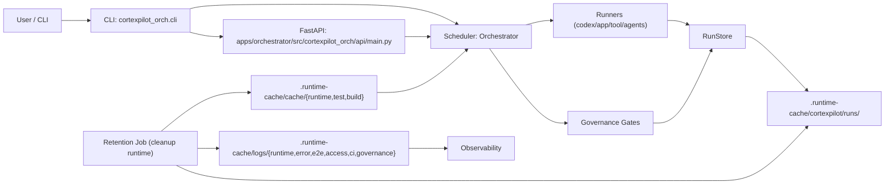

# Runtime Topology

## Notes
- API layer should stay protocol-focused and delegate orchestration to services.
- CortexPilot's current control-layer model is hybrid: L0 is a persisted
  command-tower state plus an active brain/session when a decision must be
  made, rather than a promise that one forever-open chat window never degrades.
- Default execution posture is long-running. Explicit `Context Pack` handoff is
  a fallback for pressure, contamination, role-switch, phase-switch,
  repetition, or distortion signals; it is not the steady-state loop.
- Wake strategy is event-driven first, with low-frequency polling fallback
  layered underneath when events are delayed or unavailable.
- The repo-owned machine-readable summary of these rules now lives at
  `policies/control_plane_runtime_policy.json`.
- Current state: write-side run mutations in API (`evidence promote` / `reject` / `god-mode approve`) are routed through `OrchestrationService` first, with legacy fallback kept for test doubles and backward compatibility.
- PM intake preview now emits an advisory `execution_plan_report` before a run
  starts; it is a read-only planning surface for contract/gate/output
  prediction, not a second execution truth source.
- The same intake preview now carries a `role_contract_summary` when available,
  so the assigned-role binding (prompt ref / MCP bundle / runtime binding /
  fail-closed posture) is inspectable before execution starts.
- The same role-binding read model now persists into `manifest.json` as
  `role_binding_summary`, so post-run/read-only surfaces can inspect the same
  bundle/runtime state without promoting that summary into execution authority.
- Role-config runtime capability previews now resolve through a lightweight
  provider-capability helper so advisory read surfaces can keep their
  fail-closed provider classification without importing the full transport
  runtime on GitHub-hosted quick-path governance checks; the runtime-facing
  `provider_resolution` module still re-exports the same helper names through a
  dead-code-clean compatibility wrapper so existing callers do not lose that
  import surface.
- Role contracts for qualifying delivery roles now resolve `skills_bundle_ref`
  from the repo-owned `policies/skills_bundle_registry.json` surface, keeping
  skills bundle truth separate from agent defaults and MCP bundle truth.
- Pack registry truth lives under `contracts/packs/`; dashboard and desktop
  intake surfaces consume that metadata, while runtime execution keeps the real
  output truth under run bundles.
- Intake preview now also derives `wave_plan` and `worker_prompt_contracts`
  alongside `plan_bundle`, `task_chain`, and `contract_preview`, so operator
  planning surfaces can speak in canon planner language without changing
  execution authority.
- Queue truth currently lives in `.runtime-cache/cortexpilot/queue.jsonl`; API
  and workflow surfaces read that queue state and derive `eligible` /
  `sla_state` instead of storing a second scheduler database.
- Workflow-case truth now persists under
  `.runtime-cache/cortexpilot/workflow-cases/<workflow_id>/case.json`; API and
  operator surfaces still derive fields from runs/PM sessions, but now write a
  stable case snapshot for downstream compare/queue/proof flows.
- Workflow/control-plane reads now also expose `workflow_case_read_model`,
  which reuses the latest linked run's persisted `role_binding_summary` instead
  of inventing a second execution authority surface.
- Dashboard and desktop Workflow Case detail surfaces may project that same
  `workflow_case_read_model` directly for operator inspection, but those UI
  cards remain read-only mirrors below `task_contract`.
- Runtime artifacts (`manifest`, `events.jsonl`, reports) are generated per run.
- Runs may now also persist `artifacts/prompt_artifact.json`, a contract-derived
  snapshot of prompt/bundle/runtime-binding refs for that run. It is a
  read-only audit artifact, not a second execution authority source.
- Run detail views may now include derived decision packs such as
  `incident_pack.json`, while approval queues synthesize `approval_pack`
  summaries from run events plus manifest metadata. These are derived operator
  reading surfaces, not replacements for `manifest.json` or `events.jsonl`.
- Successful public task slices can now emit `proof_pack.json`, which packages
  the primary public result report and evidence refs into a reusable operator
  proof summary without replacing the underlying run bundle truth.
- Replay compare flows now also write `run_compare_report.json`, so compare
  summaries survive as run-local reports instead of living only in transient UI
  state.
- Run-bundle evidence logs (for example `tests/stdout.log`, `tests/stderr.log`, `codex/*/mcp_stderr.log`) are retained under `.runtime-cache/cortexpilot/runs/<run_id>/` as audit artifacts; they do not replace the primary operational log channels under `.runtime-cache/logs/`.
- Daily operator briefings are generated under `.runtime-cache/cortexpilot/briefings/` by `tooling/briefing_generator.py`; this is a governed reporting surface rather than an ad-hoc scratch directory.
- Chain orchestration now emits lifecycle evidence in `reports/chain_report.json` (`lifecycle` section) and event stream markers (`CHAIN_HANDOFF_STEP_MARKED`, `CHAIN_LIFECYCLE_EVALUATED`, `CHAIN_COMPLETED`) for PM→TL→Worker→Reviewer→Testing→TL→PM closure and reviewer quorum outcomes.
- Control-plane role transitions can be represented with `task_chain` `handoff` steps, keeping PM/TL transitions explicit and auditable without execution-side effects.
- Handoff summaries are now contract-authoritative read surfaces only; they may
  summarize risks and next-role context, but they do not rewrite the execution
  instruction carried by the task contract.
- Retention policy controls run/worktree/log/cache/codex-home/intake/contract-artifact lifecycle, plus repo-owned machine-cache child retention under `~/.cache/cortexpilot`, and writes reports to `.runtime-cache/cortexpilot/reports/retention_report.json`.
- Retention reports now also expose `log_lane_summary`, `test_output_visibility`, `space_bridge`, and `machine_cache_summary`, so canonical log lanes, the latest repo-side space audit, and machine-cache cap/TTL pressure are visible from one runtime-governance receipt.
- CI governance reports share the governed root `.runtime-cache/cortexpilot/reports/ci/`; policy tracks the root plus the authoritative `current_run/` receipt surface, while the stable leaf report lanes currently include `artifact_index/`, `break_glass/`, `cost_profile/`, `evidence_manifest/`, `portal/`, `routes/`, `runner_health/`, `sbom/`, and `slo/`.
- Release-evidence builders write provenance, release-anchor, canary, RUM, and DB-migration governance outputs under `.runtime-cache/cortexpilot/release/`.
- Space-governance reports write repo/external/shared-layer audit snapshots under `.runtime-cache/cortexpilot/reports/space_governance/`, embed the latest retention summary for log/evidence visibility, and expose `governance_owner` / `preserve_reason` / rebuild metadata per entry so operator-facing cleanup decisions stay explicit.
- Managed backup snapshots live under `.runtime-cache/cortexpilot/backups/`; they are runtime-owned historical safety nets, not primary truth surfaces and not part of default cleanup scope.
- Shared transient cache buckets also include `.runtime-cache/cache/tmp/` and `.runtime-cache/cache/gemini_ui_audit/` when test or Gemini audit flows need bounded scratch space beyond the canonical `runtime/test/build` lanes.
- Codex diagnostic-mode runs may legitimately materialize under `.runtime-cache/cortexpilot/runs_diagnostic/`; this is a governed parallel run-root for diagnostic-only execution, not a replacement for the primary `.runtime-cache/cortexpilot/runs/` surface.
- Browser profile runtime state is allowed only under `.runtime-cache/cortexpilot/browser-profiles/`; the older root `.runtime-cache/browser-profiles/` is a legacy compatibility surface and must not be treated as the preferred runtime root.
- Local host development now defaults browser policy to `allow_profile` against
  the repo-owned Chrome user-data root
  `~/.cache/cortexpilot/browser/chrome-user-data`; CI, repo CI containers, and
  clean-room recovery lanes still fail closed to ephemeral browser state so
  they never depend on an existing login session.
- The one-time migrate step copies the default-Chrome display name
  `cortexpilot` into that repo-owned root as `Profile 1`, together with a
  rewritten `Local State` that points only at the repo-owned profile.
- `allow_profile` is now attach-first: the runtime checks the fixed CDP
  endpoint `127.0.0.1:9341`, verifies that the owning Chrome process really
  uses the repo-owned root, and only launches a new headed Chrome instance when
  that singleton is absent.
- A launch attempt must now survive a short post-launch stability check before
  the repo records it as a valid singleton. If Chrome briefly appears and then
  falls back to stale/offline state, the launch path fails closed instead of
  returning a false-positive success.
- If the repo-owned root is already offline, stale singleton lockfiles and the
  stale singleton state record are now removed so the status surface reports a
  clean `offline` state rather than a lingering stale launch record.
- On macOS the launcher now retries once through `open -na "Google Chrome"` if
  the direct executable fails to bind the repo-owned singleton root to `9341`.
  The retry keeps the same repo-owned `Profile 1` root and still fails closed
  if a different root or a non-managed same-root process is what blocked the
  launch.
- Login persistence now depends on keeping that repo-owned root stable and
  reusing the same headed Chrome singleton. The runtime closes automation pages
  before Playwright teardown instead of closing the entire browser or reseeding
  the root on every run.
- If the singleton CDP port is owned by another root, the repo-owned root is
  occupied by a Chrome process without CDP, or the repo-owned profile cannot be
  resolved to `Profile 1`, the local host path fails closed instead of guessing
  or second-launching the default Chrome root.
- Stale singleton cleanup keys off the configured repo-owned CDP port instead
  of a hard-coded default port, so non-default singleton endpoints do not
  inherit lock-state decisions from an unrelated Chrome root.
- A same-root legacy-port process is now treated as a managed transition path:
  the repo may stop that legacy singleton and relaunch the same root on `9341`
  instead of misclassifying it as a foreign process.
- Contract artifact cleanup scope follows configured `CORTEXPILOT_RUNTIME_CONTRACT_ROOT` inside `.runtime-cache/cortexpilot/contracts/`.
- Root cleanliness and runtime artifact routing are SSOT-driven by `configs/root_allowlist.json` + `configs/runtime_artifact_policy.json`; root-noise directories such as root `logs/`, root `.next/`, and root coverage artifacts are treated as governance violations rather than acceptable steady state.
- JS runtime machine state is app- or package-local and explicit: only `apps/dashboard/node_modules`, `apps/dashboard/.next`, `apps/dashboard/tsconfig.tsbuildinfo`, `apps/dashboard/tsconfig.typecheck.tsbuildinfo`, `apps/desktop/node_modules`, `apps/desktop/dist`, `apps/desktop/tsconfig.tsbuildinfo`, and `packages/frontend-api-client/node_modules` are allowed repo-local machine-managed surfaces; root `node_modules` remains forbidden.
- Staged dashboard UI-audit workspaces must keep required
  `packages/frontend-api-client`, `packages/frontend-api-contract`, and
  `packages/frontend-shared` sources inside the temporary workspace root
  itself; out-of-root `packages` symlinks are rejected by Next/Turbopack and
  therefore do not satisfy the hosted smoke-build contract.
- When dashboard or desktop dependency bootstrap hits repeated pnpm
  `ERR_PNPM_ENOENT` failures, recovery must escalate from fresh-store retries
  to a workspace-local store path so the clean-room / UI-audit lanes stop
  repeating the same failing cross-cache copy route.
- Log rotation remains owned by `observability/logger.py` (`RotatingFileHandler` + gzip rollover), while lifecycle cleanup remains owned by runtime retention and guarded high-yield cleanup remains owned by space governance. The three layers are complementary, not interchangeable.
- `~/.cache/cortexpilot` is the repo-external strong-related cache root, but it is still machine-shared across local CortexPilot worktrees and branches. Treat it as governed shared cache, not single-repo private disk.
- Runtime retention applies the default **20 GiB** cap at the machine-cache
  root by reclaiming only repo-owned child paths explicitly marked for
  auto-clean in `configs/space_governance_policy.json`; observe-only entries
  such as `toolchains/python/current` stay outside automatic apply scope.
- The repo-owned browser singleton subtree under
  `~/.cache/cortexpilot/browser/` is explicitly protected and cap-excluded. It
  stays auditable, but it never becomes a TTL/cap cleanup candidate.
- Repo-owned Docker build cache now also has a governed home under
  `~/.cache/cortexpilot/docker-buildx-cache/` when `docker buildx` is
  available. That turns rebuildable local CI image cache into a first-class
  repo-owned external cache instead of leaving it as a purely opaque daemon
  layer.
- Heavy machine-scoped temp producers now default into the governed
  `~/.cache/cortexpilot/tmp/` subtree instead of Darwin `TMPDIR`. Current
  examples include local `docker_ci` host runner temp
  (`tmp/docker-ci/runner-temp-*`) plus clean-room recovery machine cache /
  preserve roots (`tmp/clean-room-machine-cache.*`,
  `tmp/clean-room-preserve.*`).
- The latest Docker runtime audit/prune receipt lives beside the rest of the
  space-governance evidence at
  `.runtime-cache/cortexpilot/reports/space_governance/docker_runtime.json`,
  and `space_governance/report.json` now embeds its summary.
- Log envelope SSOT is `schemas/log_event.v2.json`, and machine-consumed log correlation must stay auditable through `lane` + `correlation_kind`.
- Runtime de-monolith modules now carry orchestration helper load while preserving existing contracts: `api/main_*_helpers.py` + `api/main_runs_handlers.py` (API compatibility handlers), `chain/runtime_helpers.py` + `chain/runner_execution_helpers.py`, `replay/replay_helpers.py` + `replay/replayer_*_helpers.py`, `scheduler/preflight_gate_*` + `scheduler/task_execution_*` + `scheduler/execute_task_*`, `runners/agents_*_runtime.py` + `runners/agents_*_helpers.py`, and helper splits for planning/store/cli (`planning/intake_*_helpers.py`, `store/run_store_*_helpers.py`, `cli_*_helpers.py`).
- State-store compatibility helpers now aggregate workflow cards from the newest manifest timestamp instead of raw directory traversal order; this keeps `/api/workflows` status snapshots stable across Python/runtime/filesystem variants when multiple runs share one workflow id.
- Scheduler preflight bridge (`scheduler/execute_task_preflight.py`) now applies dependency and tool-loader overrides (`load_search_requests`, `load_browser_tasks`, `load_tampermonkey_tasks`) with restore-on-exit semantics, so test/runtime injections do not leak mutable global bindings across runs.
- Runtime-root test rebinding must invalidate cached config before switching roots; otherwise parallel/xdist orchestrator tests can read stale `.runtime-cache` locations and produce false-negative tool-pipeline evidence paths.
- Tool-pipeline search artifact writers now reuse the active `RunStore` instance for `search_results`, `verification`, and AI verification persistence so run-local artifact roots/locks stay consistent under parallel GitHub-hosted CI and protected manual verification lanes.
- Tool-pipeline browser integration tests should stub `cortexpilot_orch.runners.tool_runner.BrowserRunner` instead of patching higher-level `ToolRunner.run_browser`; this keeps browser-task mocks stable even when scheduler/runtime layers hold imported `ToolRunner` references during large parallel suites.
- When `apps/orchestrator` points its provider base URL at
  `Switchyard /v1/runtime/invoke`, the current compatibility layer only covers
  chat-style intake/operator flows. It forces `chat_completions` for those
  paths, but MCP tool execution still fails closed until a tool-capable
  provider path exists; this keeps the runtime-first adapter honest instead of
  claiming full worker/tool parity too early.
- Prompt 10 follow-up slices now also project a derived runtime capability
  summary (`lane`, `compat_api_mode`, `provider_status`, `tool_execution`)
  through intake previews, run manifests, operator-copilot briefs, and the
  dashboard/desktop `Contracts` plus `Run Detail` surfaces; this keeps the
  runtime boundary readable without upgrading chat-compatible lanes into full
  execution parity.
- Contract package entrypoints (`cortexpilot_orch.contract`) now lazy-load
  `compiler` / `validator` submodules, so CI/governance readers such as
  `scripts/check_schedule_boundary.py` can stay below runtime-provider
  dependencies on Quick Feedback lanes instead of importing `httpx` just to
  validate queue/report schemas.
